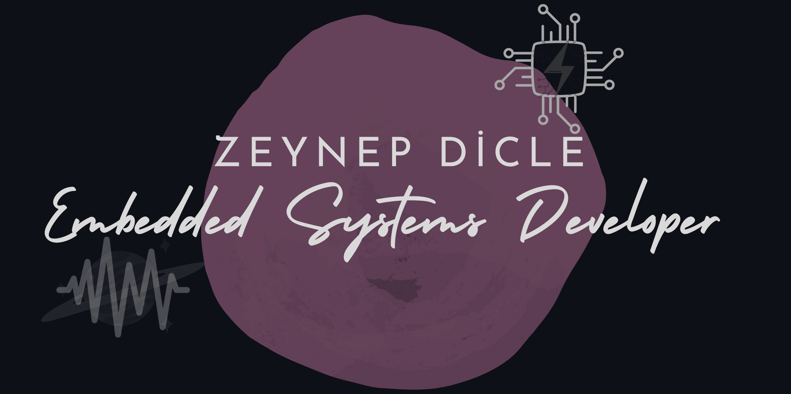

### Hi 👋, I am Zeynep Dicle

<!--
    
A passionate embedded system developer from Turkey. I work in hardware design, embedded software development, testing and analysis at [@rftek](https://github.com/rftek-electronics). I am involved in the open source [@deneyap](https://github.com/deneyapkart) project. I also do volunteer work for gender and women's empowerment at [SistersLab](https://sisterslab.co/). I share what I learned in all processes in [my blog](https://sisterslab.co/yazar/zeynep-dicle/) posts.
-->

            

     

<!--
**zeynepdicle/zeynepdicle** is a ✨ _special_ ✨ repository because its `README.md` (this file) appears on your GitHub profile.

Here are some ideas to get you started:

- 🔭 I’m currently working on ...
- 🌱 I’m currently learning ...
- 👯 I’m looking to collaborate on ...
- 🤔 I’m looking for help with ...
- 💬 Ask me about ...
- 📫 How to reach me: ...
- 😄 Pronouns: ...
- ⚡ Fun fact: ...
-->

